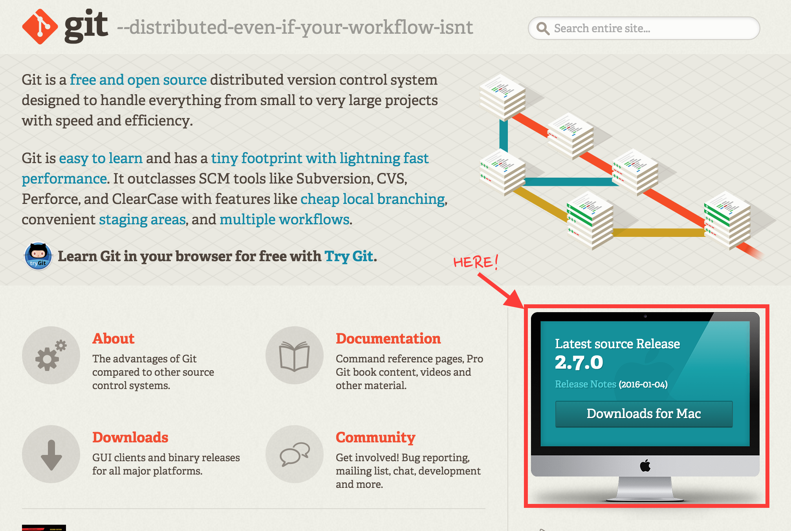
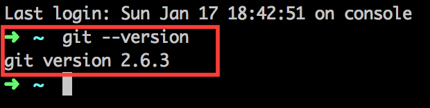
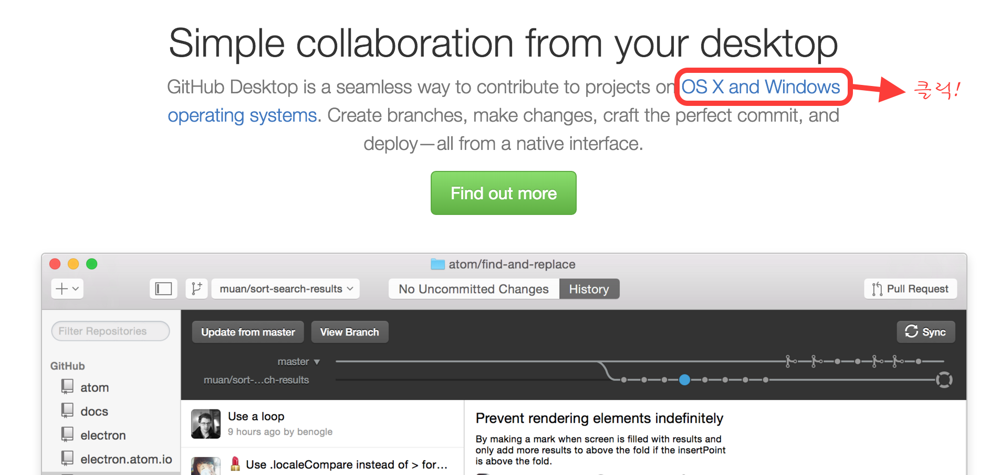
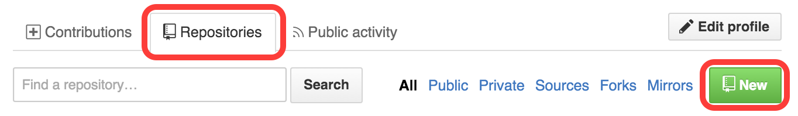
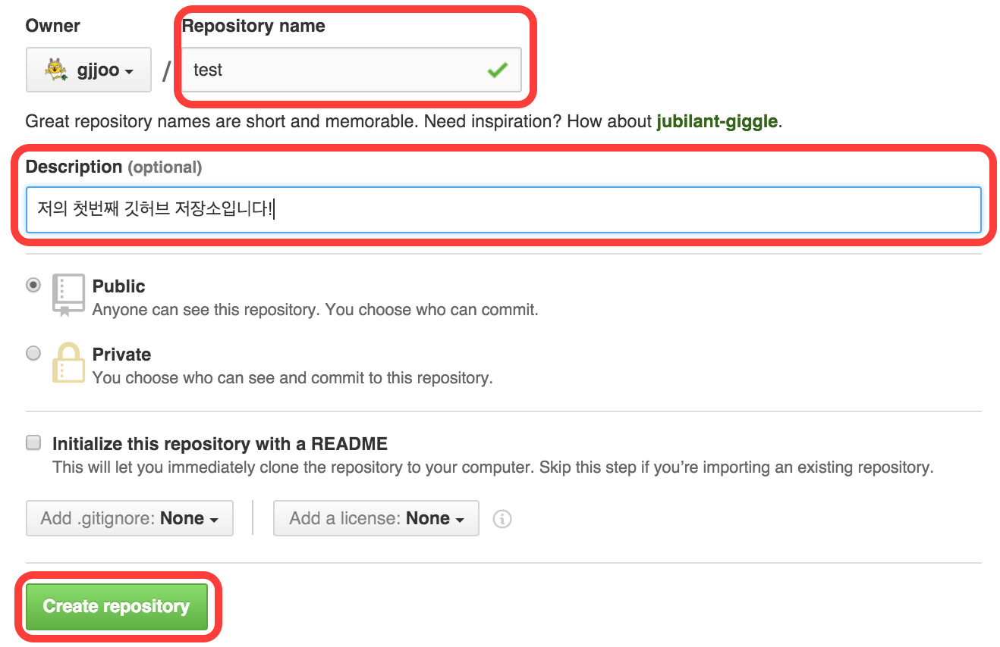
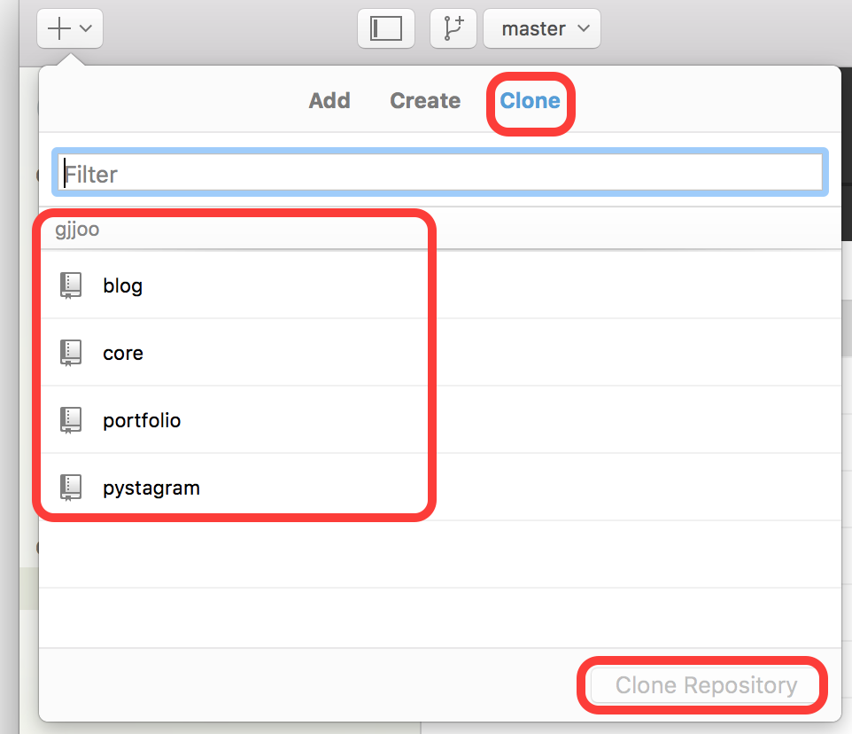
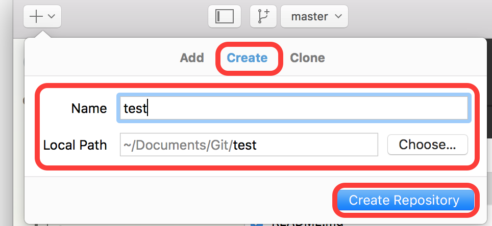
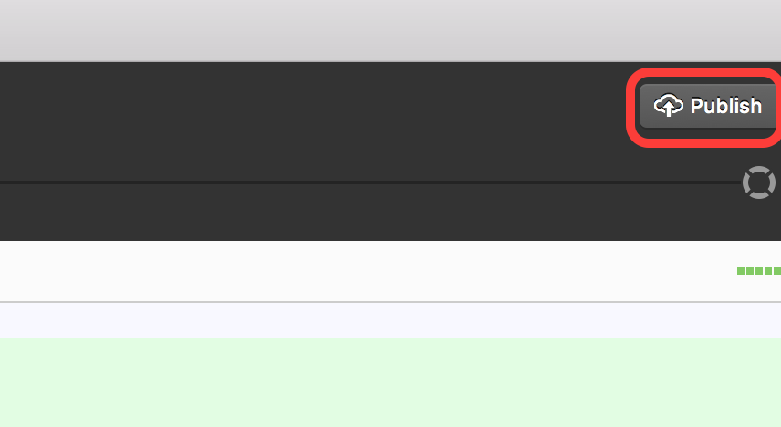
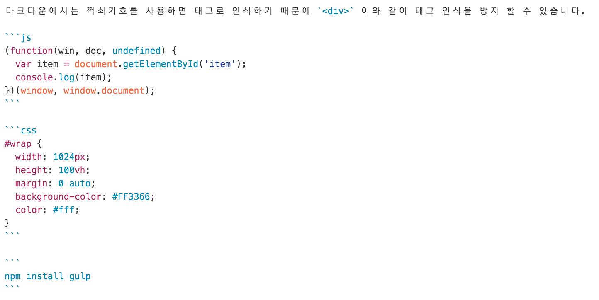

# Git & Github & Markdown

## Git
Git은 소스 코드 관리를 위한 분산 버전 관리 시스템입니다. 빠른 수행 속도에 중점을 두고 있어 상대적으로 SVN, CVS보다 빠릅니다. SVN과 Git의 차이점은 SVN은 중앙 집중식 소스코드로 관리되는 방식인 방면에 Git은 분산 소스코드 관리 방식입니다. SVN은 중앙 저장소에 인터넷이 안된다던지, 자료가 날라갔다던지 했을 경우 복원할 수 없지만, Git은 개인 로컬 저장소에서 히스토리가 관리되기에 복원할 수 있는 장점이 있습니다.

버전 관리 시스템은 개발자 뿐만 아니라 웹디자이너, 웹퍼블리셔 모든 대상에게 필요한 시스템입니다. 국내에서는 SVN이 개발자들의 고유 도구였지만 해외에서는 그렇지 않습니다. 각 분야 가리지 않고 모두 협업을 위해 버전 관리 시스템을 이용하고 있으며 IT 종사자라면 반드시 필요한 시스템이지 않나 생각됩니다.

**참고 자료**
  - [Git Book 한국어판](https://git-scm.com/book/ko/v2) : Git에 대해 좀더 자세한 내용

<br>

### Git 설치방법
[Git](https://git-scm.com) 홈페이지에 접속하셔서 다운로드 받으시면 됩니다.
> 

<br>

### Git 버전확인
Git을 설치한 후 터미널로 설치여부를 알 수 있습니다.
- Mac 사용자: OS에서 기본적으로 제공하는 terminal을 연 후 `git --version` 입력.
- Window 사용자: Git을 설치할때 함께 설치했던 `Git-Bash`를 실행하여 `git --version` 입력.

> 

<br>

## Github
Gihub는 Git을 이용하여 사용자에게 GUI(Graphic User System)을 제공합니다.
오픈소스이며 `public`이 아닌 `private`을 이용하려면 별도의 요금이 필요합니다.
해외 모든 프로젝트는 Github를 이용한다는 말이 있을 정도로 그만큼 많은 IT 해외기업의 오픈소스 프로젝트들이 Github를 이용하고 있기에 필수이지 않나 싶습니다.

<br>

### Github 설치방법
[Github](https://www.github.com) 홈페이지에 접속하셔서 다운로드 받으시면 됩니다.

> 

<br>

### 새로운 저장소 만드는 방법들
__*첫번째 방법:*__ Github 사이트에서 저장소를 만드는 방법입니다.

1. Repositories 탭에서 `NEW` 버튼 클릭!
2. 저장소 이름과 설명을 입력하고 `Create repository` 해줍니다.
3. `Local Application`으로 돌아간 후 `Clone 탭`에서 생성한 저장소를 `Clone Repository` 해줍니다.



***



***



<br>

__*두번째 방법:*__ `Github Local Application`에서 만드는 방법입니다.

1. 왼쪽 상단의 `+` 버튼을 누른 후 Create탭에서 생성할 저장소의 이름을 입력하고 `Create Repository` 해줍니다.
2. 오른쪽 상단의 `Publish` 를 해주면 웹서버와 로컬서버의 저장소가 동기화 됩니다.



***



## Markdown 문법 살펴보기
**참고 자료**
- [Markdown Syntax Guide](https://guides.github.com/features/mastering-markdown/)
- [Emoji Icon Cheat Sheet](http://www.emoji-cheat-sheet.com/)

### 지원 기능들
- Headers
```md
# Hello Markdown!
## Hello Markdown!
### Hello Markdown!
#### Hello Markdown!
##### Hello Markdown!
###### Hello Markdown!`
```
- Emphasis
```md
*This text will be italic*

_This will also be italic_

**This text will be bold**

__This will also be bold__

_You **can** combine them_
```
- List
```md
* 메뉴1
* 메뉴2
  + 메뉴2-1
  + 메뉴2-2

1. 메뉴1
  - 메뉴1-1
  - 메뉴1-2
2. 메뉴2
```
- Images, Links
```md

[](http://www.youtube.com)

[Bioshock](https://www.youtube.com/watch?v=5qa_xNPNz3w)
```
- Blockquotes
```md
> Lorem ipsum dolor sit amet, consectetur adipisicing elit. Odio accusamus vel, cumque labore officia consequuntur veniam et ullam dolore minima.
```
- Inline Code, Syntax Highlighting

- Task Lists
```md
- [x] 포토샵
- [ ] 일러스트
- [ ] 스케치
```
- Tables
```md
단어 | 설명
----|----
ul | Unordered list
ol | Ordered list
li | List item
```
- Emoji Icons (for Github)
```md
:sunglasses:
:musical_note:
:runner:
:cry:
```
- Horizontal Rules
```md
* * *

***

*****

- - -

---
```